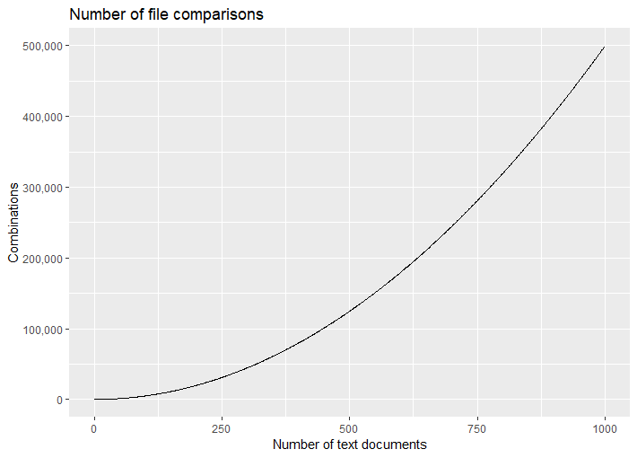

# comparefiles

comparefiles offers a practical command line interface to search for identical files or similar files in a directory and all its subdirectories.

## How it works

When searching for identical files, the program calculates a MD5 hash for each file. Files that have an identical hash are then presented on the screen. This works for all types of files.

When searching for similar files, the program compares the file content across files using [Levenshtein distance](https://en.wikipedia.org/wiki/Levenshtein_distance). Searching for similar files is only available for text files.

## Usage

```bash
$ comparefiles.py [-h] [--sort] [--ext extension] [--dir directory]
                       [--algorithm name] [--similar] [--identical]
                       [--version]
```

## Dependencies

Package [FuzzyWuzzy](https://github.com/seatgeek/fuzzywuzzy) is used to calculate the Levenshtein distance and package [python-Levenshtein](https://github.com/ztane/python-Levenshtein/) is used to speed up the calculation using C. Install them with pip:

```
pip install fuzzywuzzy 
pip install python-Levenshtein
```

## Examples

### Find identical files

The following will search for all identical (`--identical`) .py files (`--ext .py`) in current directory and all subdirectories.

```bash
$ python comparefiles.py --identical --ext .py
```

```
Searching for identical .py files in C:\Foo\Bar...
Identified 47 files

29a6a1e050bd42fe24cd17b138d4b08d  \trackthenews\build\lib\trackthenews\__init__.py
29a6a1e050bd42fe24cd17b138d4b08d  \trackthenews\trackthenews\__init__.py

c52ffcfb32d03e7e0b90138c8d438092  \trackthenews\trackthenews\core.py
c52ffcfb32d03e7e0b90138c8d438092  \trackthenews\build\lib\trackthenews\core.py

d41d8cd98f00b204e9800998ecf8427e  \newsdiffs\website\__init__.py
d41d8cd98f00b204e9800998ecf8427e  \newsdiffs\website\frontend\management\commands\__init__.py
d41d8cd98f00b204e9800998ecf8427e  \newsdiffs\website\frontend\management\__init__.py
d41d8cd98f00b204e9800998ecf8427e  \newsdiffs\website\frontend\__init__.py
d41d8cd98f00b204e9800998ecf8427e  \newsdiffs\website\frontend\migrations\__init__.py

Found 3 matches across 9 files
```

### Compare file similarity

The following will compare similarity (`--similar`) for all text files (`--ext .txt`) in directory C:\Foo and all its subdirectories (`--dir C:\Foo`), and sort the results so that most similar are at the top (`--sort`):

```bash
$ python comparefiles.py --similar --ext .txt --dir C:\Foo --sort
```

```
Searching for similar .txt files in C:\Foo...
Identified 4 files

100%  \file3.txt                            \file4.txt
98%   \file1.txt                            \file2.txt
69%   \file2.txt                            \file3.txt
69%   \file2.txt                            \file4.txt
67%   \file1.txt                            \file3.txt
67%   \file1.txt                            \file4.txt

Compared 4 files (6 combinations), similarity range: 67-100% (average 78%)
```

Use the `--help` for more arguments and instructions in how to change similarity algorithm.


## Number of comparisons

Note that the number of comparisons can quickly grow as the number of files checked for similarity increases.



<!-- 
# R code to plot combinatorics graph.
df <- data.frame(items=1:1000, combinations=choose(1:1000, 2))
ggplot2::ggplot(df, aes(items, combinations)) + 
    geom_line() + 
    labs(title="Number of file comparisons",
         x="Number of text documents", 
         y="Combinations") + 
    scale_y_continuous(labels = scales::comma)
-->